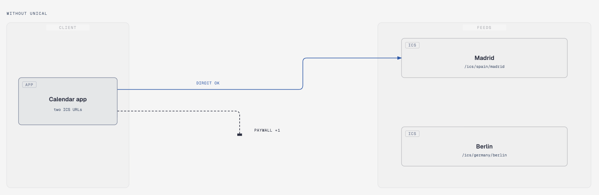

# unical

[](https://github.com/SegoCode/unical)
[](https://github.com/SegoCode/unical)
[](https://github.com/SegoCode/unical/graphs/commit-activity)
[](https://github.com/SegoCode/unical/blob/main/LICENSE)
[](https://github.com/SegoCode/SegoCode/discussions/2)

A Cloudflare Worker that combines public ICS calendar URL into one calendar. Calendar services sometimes limit the number of external calendars that an account can import or subscribe to... so this gives those services one subscription URL while the Worker fetches and combines calendars behind it.

For example; your team is split across Madrid and Berlin. You want both public-holiday calendars on the same grid, but the app only allows one external subscribe URL. The first ICS feed connects. The second is cut off as a paid slot. Point the app at unical instead: one URL, both countries.

<p align="center">

</p>

<p align="center">

</p>

## Features

- Combines ICS feeds into one `text/calendar` response.
- Fetches source calendars concurrently and caches.
- Preserves calendar components and uses UIDs to prevent collisions between feeds.
- Labels events with the merged calendar name and source calendar name.

## Quick Start & Information

### Cloudflare
Connect the GitHub repository to Cloudflare Workers and use `code` directory that contains `wrangler.toml`

### Local

```shell
cd code
pnpm install
pnpm dev
```

Run the test and verify the Wrangler bundle without deploying:

```shell
pnpm check
```

Deploy manually with Wrangler:

```shell
pnpm run deploy
```

### Available Parameters

| Parameter | Required | Default | Description |
| --- | --- | --- | --- |
| `u` | Yes | | Public ICS URL. Repeat it once for each source. Maximum: 4. |
| `name` | No | `unical` | Name of the merged calendar and title prefix. |
| `description` | No | | Calendar description (`X-WR-CALDESC`). Omitted when missing. |
| `show_name` | No | `true` | Prefix event titles with `name`. `true` or `false`. |
| `show_calendar` | No | `true` | Prefix event titles with the source calendar name. `true` or `false`. |

Example:

```shell
curl "https://unical.<subdomain>.workers.dev/merge?u=https://www.officeholidays.com/ics/spain/madrid&u=https://www.officeholidays.com/ics/germany/berlin&name=Holidays"
``` 

---
<p align="center"><a href="https://github.com/SegoCode/unical/graphs/contributors">
  
</a></p>
