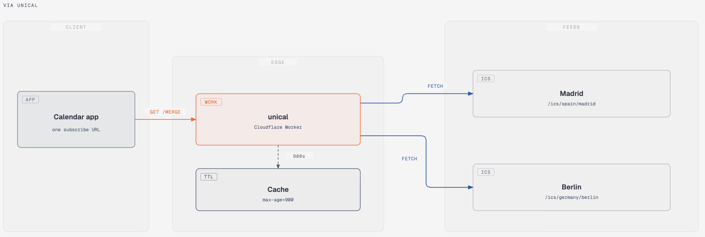

# unical

<h3 align="center"></h3>

<p align="center">
  <a href="#about">About</a> •
  <a href="#features">Features</a> •
  <a href="#quick-start--information">Quick Start & Information</a> •
  <a href="#download">Download</a> 
</p>

## About
[](https://github.com/SegoCode/unical)
[](https://github.com/SegoCode/unical)
[](https://github.com/SegoCode/unical/graphs/commit-activity)
[](https://github.com/SegoCode/unical/blob/main/LICENSE)
[](https://github.com/SegoCode/SegoCode/discussions/2)

A Cloudflare Worker that combines public ICS calendar URL into one calendar feed. Calendar services sometimes limit the number of external calendars that an account can import or subscribe to. Unical gives those services one subscription URL while the Worker fetches and combines up to four source calendars behind it.

## Features

- Combines up to four ICS feeds into one `text/calendar` response.
- Fetches source calendars concurrently and caches.
- Preserves calendar components and uses a stable SHA-256 prefix in event UIDs to prevent collisions between feeds.
- Labels events with the merged calendar name and source calendar name.

## Quick Start & Information

### Cloudflare
Connect the GitHub repository `SegoCode/unical` to Cloudflare Workers and use these settings:

| Setting | Value |
| --- | --- |
| Root directory | `code` |
| Build command | Leave empty |
| Deploy command | `npx wrangler deploy` |

The `code` directory contains `wrangler.toml`, `package.json`, `pnpm-lock.yaml`, the Worker source, and the tests. Wrangler uses `index.ts` as the Worker entry point.

Cloudflare will publish the Worker at a URL similar to:

```text
https://unical.<subdomain>.workers.dev
```

### Local

```shell
cd code
pnpm install
pnpm dev
```

Run the test and verify the Wrangler bundle without deploying:

```shell
pnpm check
```

Deploy manually with Wrangler:

```shell
pnpm run deploy
```

### Available Parameters

| Parameter | Required | Description |
| --- | --- | --- |
| `u` | Yes | Public ICS URL. Repeat it once for each source. Maximum: 4. |
| `name` | No | Name of the merged calendar and title prefix. Defaults to `Unical`. |

Example:

```shell
curl "https://unical.<subdomain>.workers.dev/merge?u=https://www.officeholidays.com/ics/spain/andalucia&u=https://www.officeholidays.com/ics/japan&name=Holidays"
``` 

---
<p align="center"><a href="https://github.com/SegoCode/unical/graphs/contributors">
  
</a></p>
